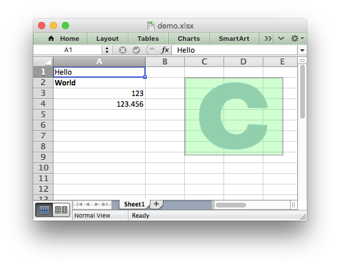

# Xlsxwriter++

> [!IMPORTANT]
> Xlsxwriter++ is still a work in progress.
>
> For the moment, it's a partial, direct, quick and dirty C++ port.
> No idiomatic C++, no rich C++ API, ...
>
> Future commit will change architecture, implementation and API without backward compatibility.

Xlsxwriter++ is a C++20 library for writing Excel XLSX files.

It is a C++ port of [libxlsxwriter](https://libxlsxwriter.github.io/).



```cpp
#include "xlsxwriterpp.h"

int main()
{
  // Create a new workbook and add a worksheet.
  xwpp::workbook_t workbook;
  xwpp::worksheet_t& worksheet = workbook.add_worksheet();

  // Add a format.
  xwpp::format_t* format = workbook.add_format();

  // Set the bold property for the format
  format->set_bold();

  // Change the column width for clarity.
  worksheet.set_column(0, 0, 20);

  // Write some simple text.
  worksheet.write_string(0, 0, "Hello");

  // Text with formatting.
  worksheet.write_string(1, 0, "World", format);

  // Write some numbers.
  worksheet.write_number(2, 0, 123);
  worksheet.write_number(3, 0, 123.456);

  // Insert an image.
  worksheet.insert_image(1, 2, "logo.png");

  workbook.save("demo.xlsx");
}
```

## Requirement

- C++20
- ZLIB
- Openssl
- Boost.Test for unit tests

## Limitations

- No support of Windows 32bits.
- No in-memory generation of XLSX file.

## Installation

After installing the requirement and cloning the repository just build the
library:

```shell
  mkdir build
  cd build

  cmake .. -DCMAKE_BUILD_TYPE=Release
  cmake --build .
```

or, for Windows (with Visual Studio 2026):

```shell
mkdir build
cd build

cmake .. -DCMAKE_BUILD_TYPE=Release -DCMAKE_TOOLCHAIN_FILE="C:\Program Files\Microsoft Visual Studio\18\Community\VC\vcpkg\scripts\buildsystems\vcpkg.cmake" -A x64 -DVCPKG_CRT_LINKAGE=dynamic

cmake --build . --config Release --target install
```

Examples can be build with the `-DBUILD_EXAMPLES=ON` option.
